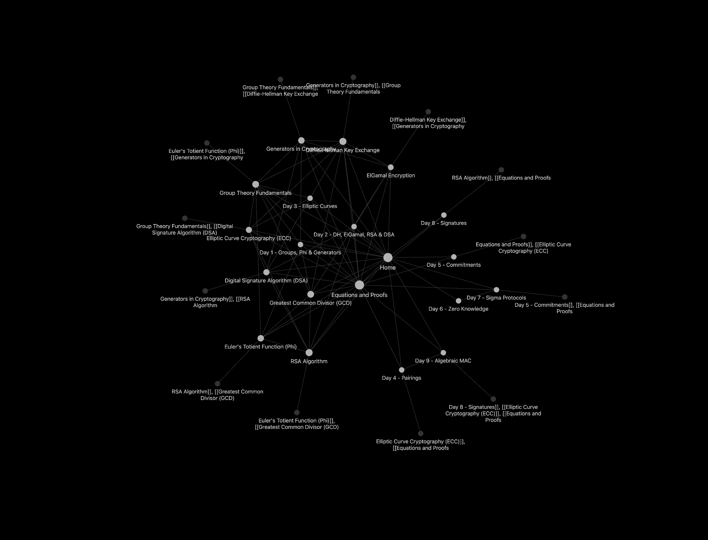

# 🔐 fekt-cpt — Cryptography Obsidian Vault

Personal Obsidian knowledge base for my cryptography studies (FEKT?).

## How to use
1. Clone the repo
2. Open the folder in **Obsidian**
3. Start at `Home.md` (or type `Ctrl/Cmd + O` → “Home”)

## Recommended plugins
- Dataview
- Excalidraw
- Spaced Repetition
- Templater

## Graph View

## Structure
- `Home.md` → main index / map of content
- `Day 1 - Groups, Phi & Generators.md` → Day 1 MOC
- `Day 2 - DH, ElGamal, RSA & DSA.md` → Day 2 MOC
- `Day 3 - Elliptic Curves.md` → Day 3 MOC
- Atomic topic notes (one concept per file) — GCD, Group Theory, Euler's Totient, Generators, DH, ElGamal, RSA, DSA, ECC
- `Equations and Proofs.md` → formula cheat sheet with links to atomic notes
